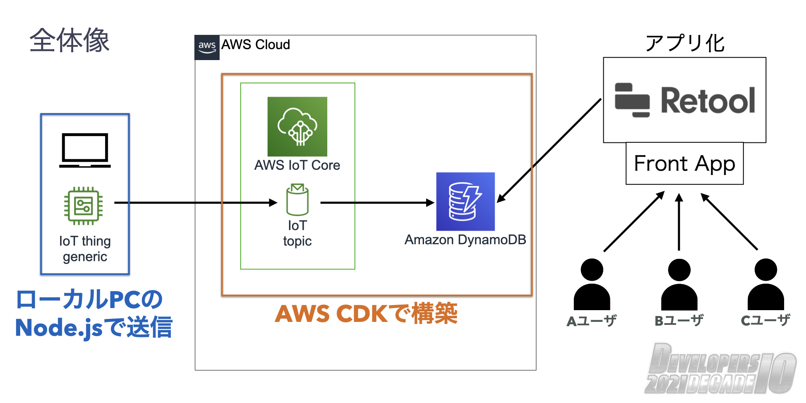

# IoT データを Retool で可視化するサンプル

IoT Rule に送信されたデータを DynamoDB に保存し、DynamoDB のデータを Retool で可視化します。
全体の構成図は以下のようになります。



IoT デバイスは自前のものも使用できますが今回はテスト用の送信スクリプトを作成しています。AWS 内部のリソース作成は AWS CDK で行います。
Retool 部分に関しては実装に含まれないため以下の動画をご参照ください

[Retool と AWS で IoT データ可視化基盤を最速で作ってみた](TBD)

# AWS へのリソース展開方法

## 動作確認しているライブラリ等のバージョン

| 名前 | バージョン |
| ---- | ---------- |
| npm  | 8.0.0      |
| node | 14.15.0    |
| cdk  | 1.126.0    |

## デプロイ方法

### AWS アカウントのクレデンシャル を設定

以下の assume-role コマンドや手動などで各環境にアクセスするためのクレデンシャル を設定する。

https://github.com/remind101/assume-role

### AWS CDK をデプロイ

以下のコマンドでデプロイできます。

```
% cdk deploy RetoolWorkStack
```

デプロイすると構成図の真ん中にある AWS 内部のリソースが作成されます。Retool で使う IAM User のアクセスキー、シークレットキーが表示されるのでメモしておきます。メモした後継続して利用する場合は、関連する部分はコメントアウトしてください。上記のキー情報と作成した IAM Role で Retool が AWS に接続できるようになります。

# デバイスダミーデータ送信スクリプトの使い方

CSV データを JSON 形式に加工して IoT Rule へパブリッシュする。

## 使用方法

### AWS アカウントのクレデンシャル を設定

CDK のデプロイ時と同様です。各自設定お願いします。

### IoT Rule にアクセスするための環境変数を設定

送信したい AWS アカウントの IoT Core のエンドポイントを設定する。
IoT Core のエンドポイント(カスタムエンドポイント)は以下の URL もしくは CLI コマンドで確認できます。
https://ap-northeast-1.console.aws.amazon.com/iot/home?region=ap-northeast-1#/settings

```
% aws iot describe-endpoint --endpoint-type iot:Data-ATS
{
    "endpointAddress": "xxxxxxxxxxxx-ats.iot.ap-northeast-1.amazonaws.com"
}
```

取得したエンドポイントをスクリプトで利用するため環境変数に設定します。

```
% export IOT_ENDPOINT=xxxxxxxxxxxxx-ats.iot.ap-northeast-1.amazonaws.com
```

### データの準備

送信する csv データを実行コマンドの第二引数に設定する。サンプルとなるデータは`src/data/device-input.csv`に設定しています。サンプルデータの項目以外の項目を追加したい場合は、`src/publisher.ts`のファイルを修正してください。

### 実行

以下のコマンドで 0.5 秒ごとに 1 回 IoT エンドポイント(IoT Rule)へデータが送信される。
途中で止める場合は、`Ctrl + C`で停止すること。

引数 1: 使用するサンプルデータ
引数 2: IoT Rule のトピック名 (トピックの前/後の名前指定も別途可能。詳細は`helper/iot/iot-client.ts` 参照)

```
% ts-node src/publisher.ts "src/data/device-input.csv" retool-topic/
```
